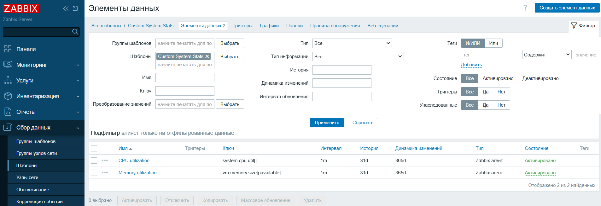
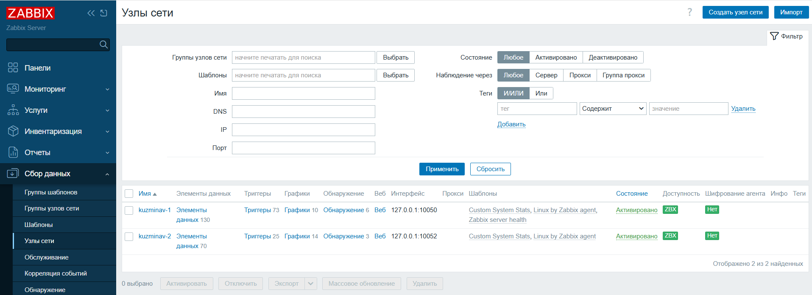
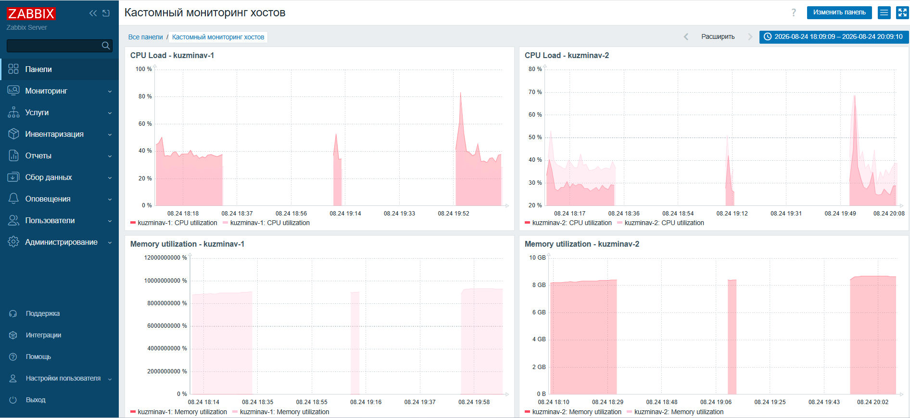

# Домашнее задание к занятию "`Система мониторинга Zabbix. Часть 2`" - Кузьмина Варвара

### Задание 1
Создан собственный шаблон `Custom System Stats`, содержащий элементы данных для мониторинга нагрузки на процессор (CPU) и оперативную память (RAM).

*Ключи элементов:*
- CPU: `system.cpu.util[]`
- RAM: vm.memory.size[pavailable] (позже заменен на vm.memory.size[used] для совместимости с шаблоном OS Linux)

---

### Задание 2 и 3
1. Установлены и настроены два Zabbix-агента (`kuzminav-1` на порту 10050 и `kuzminav-2` на порту 10052).
2. В веб-интерфейсе Zabbix добавлены соответствующие узлы сети.
3. К обоим узлам привязаны шаблоны `Linux by Zabbix agent` и `Custom System Stats`.
4. Получение данных и доступность агентов подтверждены зеленым индикатором ZBX.

---

### Задание 4
Создан кастомный дашборд «Кастомный мониторинг хостов», отображающий графики загрузки процессора и использования оперативной памяти для обоих хостов (`kuzminav-1` и `kuzminav-2`).

