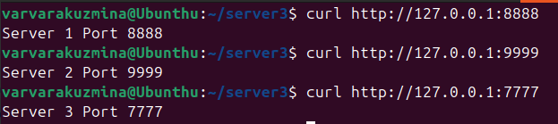
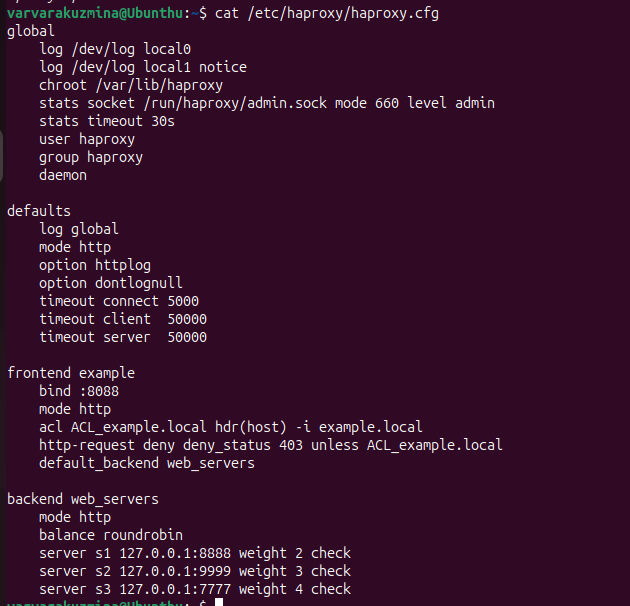
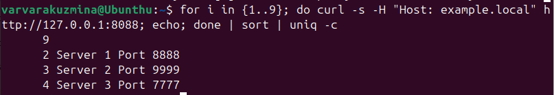
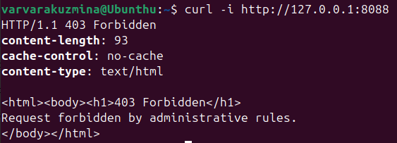

# Домашнее задание к занятию "`Кластеризация и балансировка нагрузки`" - `Кузьмина Варвара`


---

## Задание 1. Балансировка Round-robin на 4 уровне с помощью HAProxy

### 1. Запуск двух простых Python-серверов

Созданы два каталога с разным содержимым `index.html`:

- `~/server1/index.html` → содержимое «Server 1 Port 8888»
- `~/server2/index.html` → содержимое «Server 2 Port 9999»

Команды:

```bash
mkdir -p ~/server1 ~/server2
echo "Server 1 Port 8888" > ~/server1/index.html
echo "Server 2 Port 9999" > ~/server2/index.html
```

Запуск серверов на разных портах (8888 и 9999):

```bash
cd ~/server1 && python3 -m http.server 8888
cd ~/server2 && python3 -m http.server 9999
```

Проверка, что оба сервера отвечают:

```bash
curl http://127.0.0.1:8888
curl http://127.0.0.1:9999
```


---

### 2. Установка и настройка HAProxy

Установка:

```bash
sudo apt update
sudo apt install haproxy -y
```

### Конфигурационный файл `/etc/haproxy/haproxy.cfg`

```haproxy
global
    log /dev/log local0
    log /dev/log local1 notice
    chroot /var/lib/haproxy
    stats socket /run/haproxy/admin.sock mode 660 level admin
    stats timeout 30s
    user haproxy
    group haproxy
    daemon

defaults
    log global
    mode tcp
    option tcplog
    option dontlognull
    timeout connect 5000
    timeout client  50000
    timeout server  50000

listen web_tcp
    bind :1325
    mode tcp
    balance roundrobin
    server s1 127.0.0.1:8888 check inter 3s
    server s2 127.0.0.1:9999 check inter 3s
```

Проверка конфига и перезапуск:

```bash
sudo haproxy -f /etc/haproxy/haproxy.cfg -c
sudo systemctl restart haproxy
sudo systemctl status haproxy
```


---

### 3. Проверка балансировки Round-robin

Серия запросов через HAProxy (порт 1325):

```bash
for i in {1..6}; do curl -s http://127.0.0.1:1325; echo; done
```

Результат — ответы чередуются между двумя серверами:

```
Server 1 Port 8888
Server 2 Port 9999
Server 1 Port 8888
Server 2 Port 9999
Server 1 Port 8888
Server 2 Port 9999
```


---

### Вывод

Настроена балансировка нагрузки на транспортном уровне (L4, TCP) с алгоритмом **Round-robin**. HAProxy слушает порт `1325` и поочерёдно перенаправляет TCP-соединения на два Python-сервера: `127.0.0.1:8888` и `127.0.0.1:9999`. Проверка через `curl` подтверждает равномерное распределение запросов между бэкендами.

---

# Задание 2. Weighted Round Robin на 7 уровне (HAProxy)

## 1. Запуск трёх простых Python-серверов

Созданы три каталога с разным содержимым `index.html`:

- `~/server1/index.html` → «Server 1 Port 8888»
- `~/server2/index.html` → «Server 2 Port 9999»
- `~/server3/index.html` → «Server 3 Port 7777»

Запуск:

```bash
cd ~/server1 && python3 -m http.server 8888
cd ~/server2 && python3 -m http.server 9999
cd ~/server3 && python3 -m http.server 7777
```

Проверка, что все три сервера отвечают:

```bash
curl http://127.0.0.1:8888
curl http://127.0.0.1:9999
curl http://127.0.0.1:7777
```



---

## 2. Конфигурация HAProxy

Файл `/etc/haproxy/haproxy.cfg`:

```haproxy
global
    log /dev/log local0
    log /dev/log local1 notice
    chroot /var/lib/haproxy
    stats socket /run/haproxy/admin.sock mode 660 level admin
    stats timeout 30s
    user haproxy
    group haproxy
    daemon

defaults
    log global
    mode http
    option httplog
    option dontlognull
    timeout connect 5000
    timeout client  50000
    timeout server  50000

frontend example
    bind :8088
    mode http
    acl ACL_example.local hdr(host) -i example.local
    http-request deny deny_status 403 unless ACL_example.local
    default_backend web_servers

backend web_servers
    mode http
    balance roundrobin
    server s1 127.0.0.1:8888 weight 2 check
    server s2 127.0.0.1:9999 weight 3 check
    server s3 127.0.0.1:7777 weight 4 check
```

Ключевые моменты:

- `mode http` — балансировка на прикладном уровне (L7).
- `bind :8088` — фронтенд слушает порт 8088.
- ACL `ACL_example.local hdr(host) -i example.local` — проверяет заголовок `Host`.
- `http-request deny deny_status 403 unless ACL_example.local` — если домен не `example.local`, возвращается **403 Forbidden**, балансировка не производится.
- Бэкенд `web_servers` — weighted round robin: сервер 1 с весом **2**, сервер 2 с весом **3**, сервер 3 с весом **4**.



---

## 3. Проверка балансировки

### 3.1. С доменом `example.local`

```bash
for i in {1..9}; do curl -s -H "Host: example.local" http://127.0.0.1:8088; echo; done | sort | uniq -c
```

Результат — пропорция **2 : 3 : 4**, веса соблюдены:

```
      2 Server 1 Port 8888
      3 Server 2 Port 9999
      4 Server 3 Port 7777
```



### 3.2. Без домена `example.local`

```bash
curl -i http://127.0.0.1:8088
```

Ответ:

```
HTTP/1.1 403 Forbidden
content-length: 0
```

HAProxy не перенаправляет запрос на бэкенды — балансировка выполняется только для `example.local`.



---

## Вывод

Настроена балансировка нагрузки на прикладном уровне (L7, HTTP) с алгоритмом **Weighted Round Robin**. HAProxy слушает порт 8088 и распределяет трафик только для домена `example.local` между тремя Python-серверами в пропорции **2 : 3 : 4**. Запросы с другим `Host` отклоняются с кодом 403.

